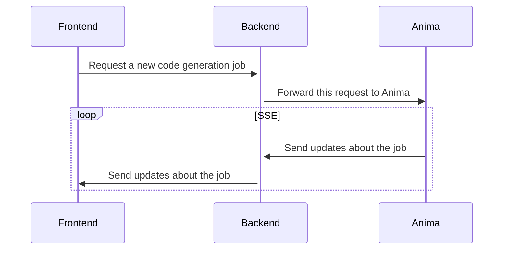

# Anima SDK


> Design to code, automated

The Anima SDK enables seamless code generation from multiple sources:

* **Figma** → Transform Figma designs into high-quality code.
* **Websites** → Convert websites from URLs or MHTML payloads into high-quality code.
* **Prompts** (Early Preview) → Generate a webapp from natural language descriptions

## Setup Overview

We provide two packages for API integration: `anima-sdk` and `anima-sdk-react`.

The `anima-sdk` package is designed for server-side use, while `anima-sdk-react` is optimized for React applications.

For security best practices, we recommend creating an `Anima` instance from `anima-sdk` on your backend to keep your Anima token private. Create a middleware endpoint on your backend following this pattern:



To simplify frontend integration, we provide `anima-sdk-react`, which initiates requests and processes [SSE](https://developer.mozilla.org/en-US/docs/Web/API/Server-sent_events/Using_server-sent_events) messages from your backend.

Let's explore each package in detail.

## `anima-sdk`

### Installing the Anima SDK

The Anima SDK is hosted on NPM, so you can add it to your project with:

```npm i @animaapp/anima-sdk```

### Code Generation Examples

Check [`example-server`](/example-server) for a tiny implementation of an endpoint that calls the Anima API.

Below are code examples for generating code from different sources.

#### Convert Figma Designs to Code

```ts
import { Anima } from "@animaapp/anima-sdk";

const anima = new Anima({
  auth: {
    token: "Your Anima Token",
    userId: "x", // Optional, only used if you want to link the request to an external id
  },
});

const { files } = await anima.generateCode({
  fileKey: "Figma Design Key",
  figmaToken: "Your Figma Token",
  nodesId: ["1:2"],
  settings: {
    language: "typescript",
    framework: "react",
    styling: "tailwind",
    uiLibrary: "shadcn",
  },
  tracking: {
    externalId: "x", // Optional, used to override the userId from auth, if provided
  },
});

console.log(files); // High-quality React code from your Figma design!
```

#### Convert Websites to Code

```ts
import { Anima } from "@animaapp/anima-sdk";

const anima = new Anima({
  auth: {
    token: "Your Anima Token",
    userId: "x", // Optional, only used if you want to link the request to an external id
  },
});

const { files } = await anima.generateCodeFromWebsite({
  url: "https://www.example.com", // The URL of the website to convert
  settings: {
    framework: "react",
    language: "typescript",
    styling: "tailwind",
  },
  tracking: {
    externalId: "x", // Optional, used to override the userId from auth, if provided
  },
});

console.log(files); // High-quality React code from your website!
```

#### Convert Private Websites to Code (Early Preview)

When you need to generate code from non-public websites (such as internal dashboards), the Anima SDK supports MHTML payloads. These can be generated using [Anima's Website Importer Chrome extension](https://chromewebstore.google.com/detail/anima-website-importer/paddhneaanoeljlmdepnheehdkaegblo).

Simply pass the `mhtml` parameter instead of the `url` parameter to the `generateCodeFromWebsite` method:

```ts
import { Anima } from "@animaapp/anima-sdk";

const anima = new Anima({
  auth: {
    token: "Your Anima Token",
    userId: "x", // Optional, only used if you want to link the request to an external id
  },
});

const { files } = await anima.generateCodeFromWebsite({
  mhtml: "... mhtml payload ...",
  settings: {
    framework: "react",
    language: "typescript",
    styling: "tailwind",
  },
  tracking: {
    externalId: "x", // Optional, used to override the userId from auth, if provided
  },
});

console.log(files); // High-quality React code from your website!
```

#### Generate Code from Text Descriptions (Early Preview)

```ts
import { Anima } from "@animaapp/anima-sdk";

const anima = new Anima({
  auth: {
    token: "Your Anima Token",
    userId: "x", // Optional, only used if you want to link the request to an external id
  },
});

const { files } = await anima.generateCodeFromPrompt({
  prompt: "Create a login form with email and password fields, a remember me checkbox, and a submit button", // Your description
  settings: {
    framework: "react",
    language: "typescript",
    styling: "tailwind",
    uiLibrary: "shadcn",
  },
  tracking: {
    externalId: "x", // Optional, used to override the userId from auth, if provided
  },
});

console.log(files); // High-quality React code from your text description!
```

### `FigmaRestApi`

A utility class for retrieving data from Figma for code generation.

#### Basic Usage

```ts
import { FigmaRestApi } from "@animaapp/anima-sdk";

const figmaRestApi = new FigmaRestApi({
  defaultOptions: { // Optional.
    token: "Figma Token", // Figma token starting with `figd_` or `figu_`
  },
});

const fileData = await figmaRestApi.getFile({
  fileKey: "Design File Key",
});
```

> :warning: If trying to set an invalid token (not starting with `figd_` or `figu_`), it'll throw an `MalformattedFigmaToken` error.

#### Options

Available options:

* `token`: Figma token starting with `figd_` or `figu_`. If not provided, the request will fail.
* `abortSignal`: An `AbortSignal` to cancel the request.
* `onForbidden`: A callback function called when we have a 403 error. It receives an instance of `NeedsReauthFigmaToken`, `ExpiredFigmaToken`, `FileNotExportable`, or `UnknownForbiddenFigmaError`. The callback can return a promise that resolves to an object with a `retry` property containing a new token, or `void` to not retry and rethrow the error. If no function is provided, it just rethrows the error.
* `onRateLimited`: A callback function called when the request is rate-limited. It receives an object with `retryAfter` (seconds to wait), `figmaPlanTier`, and `figmaRateLimitType`. Return `true` to automatically retry the request, or `false` to throw a `RateLimitExceeded` error. If no function is provided, it will always throw `RateLimitExceeded`. If the function returns `true` and you want to abort while waiting, use the `abortSignal`. Learn more about [Figma's rate limiting](https://developers.figma.com/docs/rest-api/rate-limits).

##### Overriding Options

You can override the default options for the next request using `.withOptions` when calling any method:

```ts
const abortController = new AbortController();

const fileData = await figmaRestApi
  .withOptions({
    token: "Another Figma Token",
    signal: abortController.signal,
    onForbidden: async (error) => {
      if (error instanceof ExpiredFigmaToken) {
        // Try to refresh the token
        const newToken = await refreshFigmaToken();
        return { retry: { newToken } };
      } else if (error instanceof NeedsReauthFigmaToken) {
        // Navigate to the Figma's page to authorize the app again
        navigateToFigmaAppAuthorization();
      } else if (error instanceof FileNotExportable) {
        // Notify the user that the file cannot be exported
        alert("The requested Figma file is not exportable. Please check the file permissions.");
      } else {
        // Unknown error, just rethrow
      }
    },
    onRateLimited: ({ retryAfter }) => {
      console.log('Rate limited!');
      return retryAfter < 5; // Retry only if the wait time is less than 5 seconds
    },
  })
  .getFile({
    fileKey: "Design File Key",
    nodesId: ["1:2", "1:4"],
  });
```

#### Methods

##### Has default token

Check if there is a default Figma token set.

```ts
const hasDefaultToken = figmaRestApi.hasDefaultToken(); // true | false
```

##### Get Figma File Data

```ts
const fileData = await figmaRestApi.getFile({
  fileKey: "Design File Key",
  nodesId: ["1:2", "1:4"], // Optional. If not provided, the entire file will be fetched.
});
```

##### Get Node Images

This method retrieves images from the specified nodes. Essentially, taking screenshots of the selected nodes.

```ts
const imageUrls = await figmaRestApi.getNodeImages({
  fileKey: "Design File Key",
  nodesId: ["1:2", "1:4"],
  as: "arrayBuffer", // Optional
  format: "jpg", // Optional
  scale: 1, // Optional
});
```

The `as` parameter defines the return format:

* `arrayBuffer`: Downloads the image and returns an object with `ArrayBuffer` data.
* `url`: Returns an object with URLs pointing to images hosted on Figma's servers.

##### Get Image Fills

This method retrieves URLs for image fills used in the design, hosted on Figma's servers.

For example, if you have an image used as a fill inside a rectangle, this method will return the URL of that image.

```ts
const imagesFill = await figmaRestApi.getImageFills({
  fileKey: "Design File Key",
});
```

##### Get Current User Info

```ts
const me = await figmaRestApi.getMe();
```

#### Testing

You can use a custom `fetch` implementation for testing purposes:

For example, if you want to test a rate-limit error when trying to access a specific file:

```ts
const figmaRestApi = new FigmaRestApi({
  fetch: (url, ...args) => {
    if (typeof url === 'string' && url.includes('xxxxxxxxxxxxxxxxxxxxxx')) {
      return Promise.resolve(
        new Response(JSON.stringify({ status: 429, err: 'Rate limit exceeded' }), {
          status: 429,
          headers: {
            'Retry-After': '60',
            'X-Figma-Plan-Tier': 'org',
            'X-Figma-Rate-Limit-Type': 'low',
            'X-Figma-Upgrade-Link': 'https://www.figma.com/files?api_paywall=true',
          },
        }),
      );
    }

    return fetch(url, ...args);
  },
  defaultOptions: {
    onRateLimited: ({ retryAfter }) => {
      alert('Figma API rate limited.');
      return false;
    },
  },
});
```

## `anima-sdk-react`

### Installing the Anima React SDK

The Anima React SDK is hosted on NPM and you need the base package as well to use it. So you can add both to your project with:

```npm i @animaapp/anima-sdk @animaapp/anima-sdk-react```

### Getting Started

1. **Set up the provider** - Wrap your application with the `AnimaSdkProvider` component:

```tsx
<AnimaSdkProvider
  {/* Read above how to create an instance of FigmaRestApi */}
  figmaRestApi={figmaRestApi}
  f2cUrl="/api/anima/f2c"
  l2cUrl="/api/anima/l2c"
  p2cUrl="/api/anima/p2c"
>
  ...
</AnimaSdkProvider>
```

The `f2cUrl`, `l2cUrl`, and `p2cUrl` props are optional, but you must configure at least one to use the SDK.

These props define the API endpoints for creating new code generation jobs.

2. **Create a code generation job** - Use the hook to start new jobs:

```ts
const { createJob } = useAnimaSDK();

const onClick = async () => {
  await createJob('f2c', settingsOptions)
}
```

This calls the endpoint defined in the `f2cUrl` prop and begins reading updates via SSE.

The `settingsOptions` parameter is explained in the next section.

**Note:** This method throws a `CreateJobError` if job creation fails (e.g., 404 error).

3. **Attach to a code generation job** - Use the hook to attach to existing jobs:

```ts
const { attachJob } = useAnimaSDK();

const onClick = async () => {
  await attachJob('example-job-id', settingsOptions)
}
```

This begins reading updates via SSE.

The `settingsOptions` parameter is explained in the next section.

**Note:** This method throws a `AttachJobError` if job attachment fails (e.g., 404 error).

4. **Monitor job progress** - Track the status of your job:

```ts
const { job } = useAnimaSDK();
```

**Note 1:** Human-readable progress messages are available in `job.progressMessages`, but avoid relying on specific string values for `title`, `subtitle`, or `body` in your application logic, as these may change. Use them only for user-facing displays.

**Note 2:** For testing the progress messages that hits the rate limit scenarios, we provide two mock designs:

* **Short rate limit**: Use [this design](https://www.figma.com/design/Y1TdquDVUkEVetLzKOXAp8/Mock-Design---API---Short-Rate-Limit-Exceeded?node-id=1-5&t=QP3FD7yrFORTuqtS-11) to simulate a 10-second wait.
* **Rate limit exceeded**: Use [this design](https://www.figma.com/design/AwhyxD3hSAcPDxedRjckbs/Mock-Design---API---Long-Rate-Limit-Exceeded?node-id=1-2&t=uLYu8I8kjW0KFPhh-11) to trigger a rate limit exceeded exception. It'll abort the code generation.

## Configuration Options

The following configuration options are available for customizing code generation:

> **Note:** Option availability varies by source type (Figma, website, or prompt). Source-specific limitations are noted for each option.

| Option                      | Type                                                                                                       | Description                                                                              |
| --------------------------- | ---------------------------------------------------------------------------------------------------------- | ---------------------------------------------------------------------------------------- |
| `language`                  | `"typescript" \| "javascript"` <br><br> Note: only `typescript` is currently available for websites and prompts.                                                                             | The programming language to use for code generation.                                     |
| `framework`                 | `"react" \| "html"`                                                                                        | The framework to use for code generation.                                                |
| `styling`                   | `"plain_css" \| "tailwind" \| "inline_styles"` <br><br> Note: only `tailwind` and `inline_styles` are currently available for websites and prompts. | The styling approach to use for the generated code.                                      |
| `uiLibrary`                 | `"mui" \| "antd" \| "radix" \| "shadcn"\|"clean_react"` <br><br> Note: only `shadcn` is currently available for websites and prompts. You can also omit this option to use vanilla React.                                                                   | The UI component library to use (React only).                                            |
| `responsivePages`           | `Array<{ name: string; framesId: string[] }>` <br><br> Note: only available for Figma designs.                                                              | When set, it overrides any responsive settings from the plugin.                          |
| `figmaRateLimitMaxWait`        | `number` <br><br> Note: only available for Figma designs.                                                              | Maximum wait time in seconds for Figma rate limits to expire. Minimum is `1`, maximum is `180`. Defaults to `60`.                          |
| `enableTranslation`         | `boolean` <br><br> Note: only available for Figma designs.                                                                                                  | Enable translation support (HTML only).                                                  |
| `enableCompactStructure`    | `boolean` <br><br> Note: only available for Figma designs.                                                                                                  | Generate a more compact file structure.                                                  |
| `enableAutoSplit`           | `boolean` <br><br> Note: only available for Figma designs.                                                                                                  | Automatically split components based on complexity.                                      |
| `autoSplitThreshold`        | `number` <br><br> Note: only available for Figma designs.                                                                                                   | The complexity threshold for auto-splitting components.                                  |
| `disableMarkedForExport`    | `boolean` <br><br> Note: only available for Figma designs.                                                                                                  | Disable the "marked for export" feature.                                                 |
| `allowAutoSelectFirstNode`  | `boolean` <br><br> Note: only available for Figma designs.                                                                                                  | Auto-select first valid node when passed a page with multiple children (default: `true`) |
| `enableGeneratePackageLock` | `boolean`                                                                                                  | Generate package-lock.json file.                                                         |
| `enableDisplayDataId`       | `boolean` <br><br> Note: only available for Figma designs.                                                                                                  | Add data-id attributes to elements for easier testing and selection.                     |
| `enableDisplayDataName`     | `boolean` <br><br> Note: only available for Figma designs.                                                                                                  | Add data-name attributes to elements for easier identification.                          |
| `enableAnimationsPreset`    | `boolean` <br><br> Note: only available for React with Shadcn UI library.                                                                                   | Enable basic animations for elements.                                                    |

These node IDs can then be used in the `nodesId` parameter when calling `generateCode()`.

## Asset Management

Generated code may include assets such as images and videos. You can choose from several storage strategies:

> **Note:** Website and prompt imports currently support only the `host` and `external` strategies.

### Anima-Hosted Assets

```ts
const { files } = await anima.generateCode({
  assetsStorage: { strategy: "host" },
});
```

With the `"host"` strategy, Anima hosts the asset files for you. This is the default and most convenient option.

### Self-Hosted Assets

```ts
const { files, assets } = await anima.generateCode({
  assetsStorage: { strategy: "external", url: "https://cdn.example.com" },
});
```

With the `"external"` strategy, the method returns asset metadata in an array of `{ name, url }`. Download each asset from its URL and upload it to your preferred hosting service.

### Local Assets (React SDK Only)

When using `createJob` from `@animaapp/anima-sdk-react`, you have an additional `"local"` strategy:

```ts
await createJob('f2c', {
  assetsStorage: {
    strategy: "local",
    filePath: "public/assets",
    referencePath: "/",
  },
});

// or

await createJob('f2c', {
  assetsStorage: {
    strategy: "local",
    path: "/", // equivalent of `{ filePath: "/", referencePath: "/" }`
  },
});
```

This strategy downloads all assets client-side and includes them in the `job.files` array as base64-encoded data.

The `filePath` property specifies where files are stored in your project structure, while `referencePath` defines the base path used in source references (e.g., the `src` attribute in `` tags). When both values are identical, you can use the shorthand `path` property.

## Utility Functions

The SDK includes helpful utility functions beyond code generation.

### Core SDK Utilities (`anima-sdk`)

#### `isValidFigmaUrl`

Validates whether a Figma URL is compatible with code generation.

### React SDK Utilities (`anima-sdk-react`)

#### `useFigmaFile`

The `useFigmaFile` hook retrieves data from Figma designs for exploration and node selection.

> This hook can only be called only within `<AnimaSdkProvider />`.

**Example usage:**

```tsx
import { useFigmaFile } from "@animaapp/anima-sdk-react";

function FigmaNodeExplorer() {
  const { data, isLoading, error } = useFigmaFile({
    fileKey: "your-figma-file-key", // Required.
    authToken: "your-figma-token", // Optional. By default, it'll use the Figma token provided by FigmaRestApi defined on `<AnimaSdkProvider />`
    params: { // Optional.
      depth: 2, // Controls document tree traversal depth:
                // depth: 1 - returns only pages
                // depth: 2 - returns pages and top-level objects on each page
                // omitting depth - returns all nodes (resource-intensive for large files)
    },
  });

  if (isLoading) return <div>Loading Figma file...</div>;
  if (error) return <div>Error loading file: {error.message}</div>;

  // Extract top-level node IDs from the document (when using depth: 2)
  const pages = data?.document?.children ?? [];
  const topLevelNodeIds = pages.flatMap((page) => page.children).map((frame) => frame.id);

  return (
    <div>
      <h3>Available Node IDs:</h3>
      <ul>
        {topLevelNodeIds.map(nodeId => (
          <li key={nodeId}>{nodeId}</li>
        ))}
      </ul>
    </div>
  );
}
```

## Figma OAuth recommended scopes

In order to support the full requirements, use these scopes for your Figma OAuth application:

* ```file_content:read```
* ```file_metadata:read```
* ```library_assets:read```
* ```library_content:read```
* ```team_library_content:read```
* Optionally, you can also request ```current_user:read``` if you need the user's info and plan to use ```figmaRestApi.getMe()``` API.

## Contributing

For information on developing the Anima SDK itself (not using it in your project), please refer to [`DEVELOPMENT.md`](DEVELOPMENT.md).
